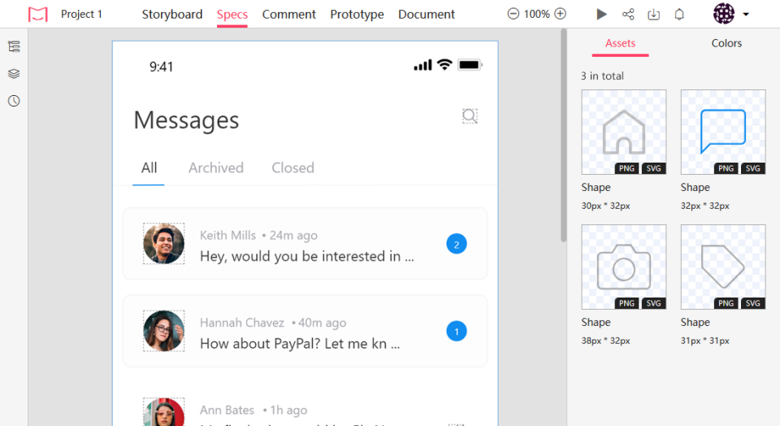

# Development Workflow & React JS
Congratulations! You have good knowledge of the HTML, CSS & Javascript, Now it's time for the React JS.

## Overview
This course will guide you through the basics of react js to develop the dynamic websites using the reusable components of react.

### What will you learn

After this sprint you will get the answers of the following:
- What is React JS?
- What are the major feature of the react?
- What are the basics of the ES6?
- What are the foundations of the React JS?
- What is the JSX?
- What are the reusable components in React JS?
- What are the features that let you use React JS over another framework/library?
- How JSX run inside the browser?
- What are the different ways of binding data?
- What is the lifecycle of the react component?
- How & where to use the lifecycle methods?
- What are the types of the component in React JS?
- How will you create the reusable components in React JS?
- How react render's the component using the virtual DOM?
- What is the use of state and props in a component?
- What are controlled and uncontrolled components?
- What is the pure functional component in React?
- How can you use the state and lifecycle methods inside the functional component?
- How to access the DOM element inside the react component?
- How react create the dom element using the JSX?
- The back story of react serving your page to the browser.
- How to use the other react dependent libraries.
- How to create modal?
- How to render an element without using an extra HTML container element?
- How to make API calls in react?
- How to handle the async data in react?
- How to design a production-level application?
- How the bundle your react application?
- How to integrate third party services into your application?
- How to test the react application?
- How to write the unit test and UI test for the react application?

### What you can build?
After this, you can build a highly responsive and dynamic application using the react custom and reusable components. One of the clones of the dynamic chat page is shown below.

### Learning Outcomes
After this sprint you will be expert in the following:

**Basics of the react foundation**
- What is react.
- JSX
- state & props
- dynamic and reusable components
- lifecycle of the react component
- dynamic loading of the page content
- use of classes in javascript
- types of component in react.
- pure components in react.
- virtual DOM
- Assignments related to topics.

**Create the dynamic website with reusable components**
- Create the dynamic components.
- How to reuse the react components.
- How to pass the props from parents to child.
- How to update the state and props of the component.
- Difference between state and props.
- Difference in HTML and react event handling.
- Bind event handlers with JSX callbacks.
- Use of the refs.
- Use of the portal.
- HOC in react.
- More about the context.
- Use of the hooks.
- Assignments related to topics.

**How to create the production level application**
 - Error handling of the client application.
 - Validations in react components.
 - Deep about the react DOM.
 - Deep about the react router.
 - Add the authentication on router.
 - Bundling of the client application.
 - Deployment of the client application.
 - SEO of the application.
 - Integrating third-party services.
 - Lazy loading.
 - Memoization of the props.
 

 ## Course Content

 ### Week 1
 **DAY 1:** Basics of the react.&nbsp;
 **DAY 2:** About JSX and fundamentals of react.&nbsp;
 **DAY 3:** Details of State, Props, LifeCycle methods and reusable components.&nbsp;
 **DAY 4:** Event handling & Event propogation.&nbsp;
 **DAY 5:** React DOM, portal and refs.&nbsp;
 **DAY 6:** React router, bundling & deployment.&nbsp;
 **DAY 7:** Error Handling, SEO and third party integration.&nbsp;

 ### Week 2
 **Mini Project**&nbsp;
 **Major Project**&nbsp;

 ## References for the courses
 - [https://reactjs.org/docs/getting-started.html](https://reactjs.org/docs/getting-started.html)
 - [https://reactjs.org/docs/react-dom.html](https://reactjs.org/docs/react-dom.html)
 - [https://reacttraining.com/react-router/web/guides/quick-start](https://reacttraining.com/react-router/web/guides/quick-start)
 - [https://github.com/ReactTraining/react-router/tree/master/packages/react-router/docs/api](https://github.com/ReactTraining/react-router/tree/master/packages/react-router/docs/api)
 - [https://medium.com/@JonathanSaring/7-react-component-collections-from-popular-libraries-f925c9803176](https://medium.com/@JonathanSaring/7-react-component-collections-from-popular-libraries-f925c9803176)